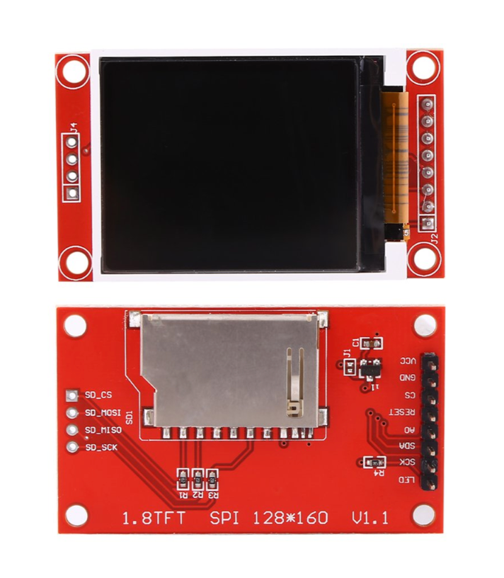
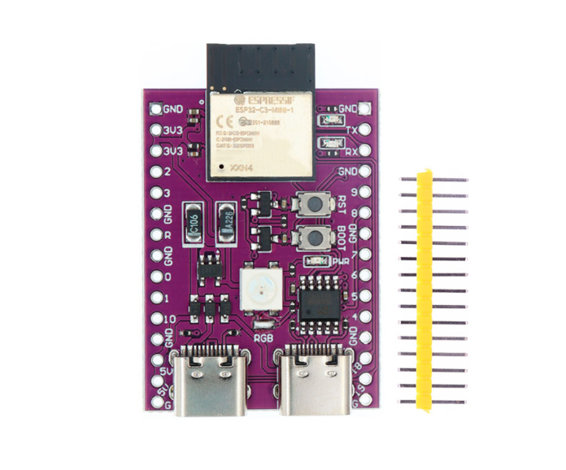

# esp32c3-st7735s

Fork of [nopnop2002/esp-idf-m5stickC](https://github.com/nopnop2002/esp-idf-m5stickC) (with minimal change) that uses ESP32-C3-mini-1 and 1.8 TFT display.

## Requirements

- [esp-idf](https://github.com/espressif/esp-idf) v5.x

## How to build and flash

```sh
idf.py set-target esp32c3
idf.py -p PORT flash
```

## TFT display

- 1.8 TFT ST7735 display



## Tested on the following boards

- ESP32-C3-mini-1



## Original README

See [README-m5stickc.md](./README-m5stickc.md).
